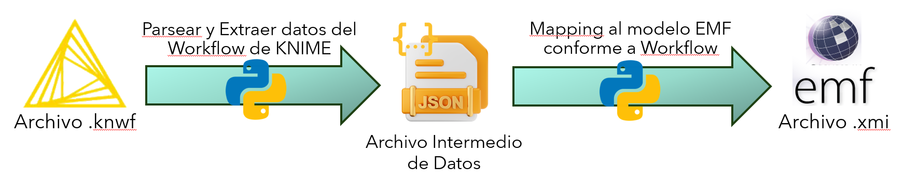
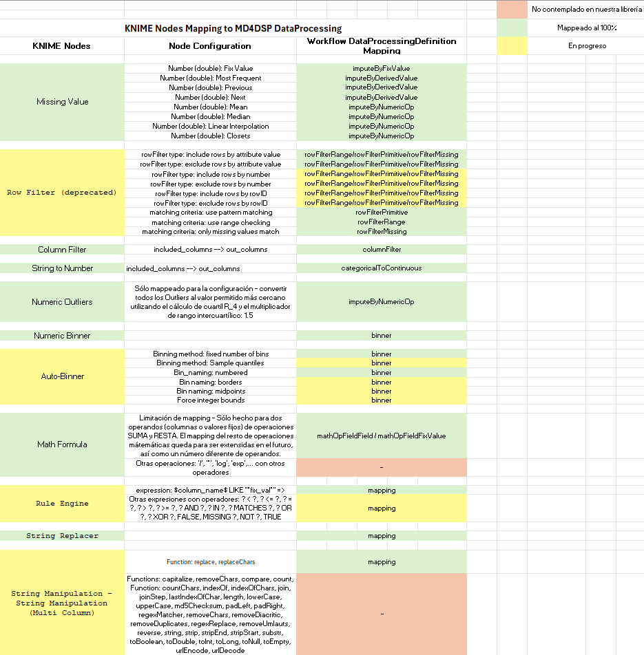

# T2M transformations with Python Parsers for MD4DSP

This project aims to map a KNIME workflow (`.knwf`) to a MD4DSP workflow (`.xmi`) using Python scripts.



The project is divided into three main scripts:

1. **`parsers/knwf2json.py`**: script that parses a KNIME workflow and exports the data to JSON intermediate file.
2. **`parsers/json2workflow.py`**: script that parses the intermediate JSON file and exports the data to a MD4DSP workflow.
3. **`parsers/knwf2workflow.py`**: script that combines the previous two scripts to parse a KNIME workflow and export the data to a MD4DSP Workflow instance.
## Prerequisites

- Anaconda Environment
- Python 3.10 (as it is the used version in the project)
- Libraries specified in `requirements.txt`

## Installation

1. Clone the repository:
   ```bash
   git clone https://github.com/carlosbc24/knime2model_MD4DSP.git
    ```

2. Navigate to the project directory:
    ```bash
    cd your-project-directory
    ```
   
3. Crate a new conda environment:
   ```bash
   conda create --name kn2wf_mapping python=3.10 --yes
   ```
   
4. Deactivate any previous environment and activate the new one:
    ```bash
    conda deactivate
    conda activate kn2wf_mapping
    ```

5. Clean conda and pip caches:
    ```shell
    conda clean --all --yes
    pip cache purge
    ```
   This step will prevent you from retrieving libraries from the conda or pip caches, which may be incompatible with
   the project's requirements. If you are sure that the libraries in the cache are compatible, you can skip this step.

6. Install the required libraries:
   ```bash
   pip install -r requirements.txt
   ```
   
7. (Optional) Edit the configuration file `parser_config.json` with the following structure:
   ```yaml
   input_knwf_folder: "input_KNIME_workflows/paper_workflows" # Folder containing the selected KNIME workflows
   output_json_folder: "parsed_json_workflows" # Folder where the parsed KNIME workflows will be saved
   output_xmi_folder: "parsed_xmi_workflows" # Folder where the parsed KNIME workflows will be saved

   include_contracts: True # Include contracts in the xmi output
   workflow_filename: "Model data set with metanode.knwf"
   #workflow_filename: "01 Data Cleaning.knwf"

   export_mapped_nodes_report: True # Export a report with the mapped nodes percentage
   ```
   
    The `input_knwf_folder` parameter must contain the path to the folder containing the KNIME workflows to be parsed and mapped.

    The `output_json_folder` parameter must contain the path to the folder where the parsed KNIME workflows will be saved in JSON format.

    The `output_xmi_folder` parameter must contain the path to the folder where the mapped KNIME workflows will be saved in xmi format, which is the MD4DSP workflow XML instance format.

   The `include_contracts` parameter is a boolean that indicates whether the contracts should be included in the xmi output or not.

   The `workflow_filename` must contain the name of the KNIME workflow to be parsed. By default, this parameter is empty,
   which means that every KNIME workflow in the input folder will be parsed. If you want to parse a specific KNIME 
   workflow, you must specify its filename with the extension `.knwf`.

    The `export_mapped_nodes_report` parameter is a boolean that indicates whether a report about the mapped nodes respect to the susceptible nodes to be mapped to the library should be exported or not.

8. (Optional) Remove the environment created previously:
   ```bash
   conda deactivate
   conda remove --name kn2wf_mapping --all --yes
   ```
   
## Mapping and Result Visualization Execution

1. Run the Python script to parse and map data from KNIME workflows to MD4DSP workflows using templates:
    ```bash
    python -m mapping.knwf2workflow
    ```
   These mapped models, stored in `parsed_xmi_workflows/` directory,can be imported directly in [MM-M4DS project](https://github.com/i3uex/MM-M4DS) next to the proyect library `library_validation.xmi`.
2. (Optional) Run the Python script visualization_scripts/contract_val_results_gui.py to deploy a GUI to visualize contract validation results from every subworkflow mapped:
   ```bash
   python -m visualization_scripts.contract_val_results_gui
   ```
   
## KNIME nodes mapping relation state with MD4DSP library transformation (library_validation.xmi)
In green, you can distinguish the nodes that have been completely mapped to the Workflow with a DataProcessing with the respective parameters and transformation dependencies.
In red the nodes that have not been mapped to the library.
In yellow the nodes that have not been completely mapped to the library yet, as it can be mapped with a limited configuration subset.


## Project Structure

The project structure must follow the next structure:

```bash
MD4DSP-m2python/
│
├── doc_images/
│  └── ...
│
├── input_KNIME_workflows/
│  ├── 01 Data Cleaning.knwf
│  ├── 02 Data Cleaning.knwf
│  ├── 02 Data Cleaning_2.knwf
│  ├── DATA CLEANING.knwf
│  ├── Data Cleaning Project.knwf
│  ├── Decision Tree Modelling - Key Triathlon Discipline Analysis.knwf
│  ├── Interactive Data Cleaning.knwf
│  ├── KNIME INTEGRATION WITH POWER  BI (DATA CLEANING).knwf
│  ├── ...
│  ├── paper_workflows/
│  │  ├── 01_Data_Cleaning_Workflow1-1
│  │  │  ├── extracted_data/
│  │  │  │  └── ...
│  │  │  ├── generated_code/
│  │  │  │  └── ...
│  │  │  ├── knime_dataDictionaries/
│  │  │  │  └── ...
│  │  │  ├── python_dataDictionaries/
│  │  │  │  └── ...
│  │  │  ├── python_dataDictionaries
│  │  │  ├── 01 Data Cleaning_Workflow1-1.knwf
│  │  │  └── 01 Data Cleaning_Workflow1-1.xmi
│  │  ├── 01_Data_Cleaning_Workflow1-2
│  │  ├── 01_Data_Cleaning_Workflow1-3
│  │  └── ...
│  └── images/
│   ├── 01 Data Cleaning.png
│   ├── 01_ Exercises.png
│   ├── 01_Column_Row_Filtering.png
│   ├── 02 Data Cleaning.png
│   ├── 02 Data Cleaning and Transformation.png
│   ├── 03_Data_Cleaning_Solution.png
│   ├── DATA CLEANING.png
│   ├── Data Cleaning Project.png
│   └── ...
│
├── library_hashing/
│  └── library_transformation_names.json
│
├── logs/
│  ├── mapping/
│    ├── mapping_log_1.log
│    ├── mapping_log_2.log
│    ├── mapping_log_3.log
│    └── ...
│
├── mapping/
│  ├── json2workflow.py
│  ├── knwf2workflow.py
│  └── knwf2json.py
│
├── parsed_json_workflows/
│  └── ...
│
├── parsed_xmi_workflows/
│  └── ...
│
├── reports/
│  └── ...
│
├── templates/
│  ├── data_processing/
│  │ ├── binner_template.xmi
│  │ ├── categoricalToContinuous_template.xmi
│  │ ├── columnFilter_template.xmi
│  │ ├── imputeByDerivedValue_template.xmi
│  │ ├── imputeByFixValue_template.xmi
│  │ ├── imputeByNumericOp_template.xmi
│  │ ├── imputeOutliersByClosest_template.xmi
│  │ ├── join_template.xmi
│  │ ├── mapping_template.xmi
│  │ ├── mathOperation_template.xmi
│  │ ├── rowFilterMissing_template.xmi
│  │ ├── rowFilterPrimitive_template.xmi
│  │ ├── rowFilterRange_template.xmi
│  │ └── unknownDataProcessing.xmi
│  ├── link.xmi
│  └── workflow_template.xmi
│
├── utils/
│  ├── json_parser_functions.py
│  ├── knime_nodes_data_extraction.py
│  ├── library_functions.py
│  ├── logger.py
│  └── report.py
│
├── visualization_scripts/
│  ├── barcharts_images/
│  │  └── ...
│  ├── 34_workflow_generated_code_validation_KNIME_data.json
│  ├── 34_workflow_generated_code_validation_Python_data.json
│  └── contract_val_results_gui.py
│
├── .gitignore
├── KNIME_nodes_MD4DSP_mapping.xlsx
├── parser_config.yaml
├── README.md
├── requirements.txt
└── TODO.md
```

- **`doc_images/`**: contains the documentation images used by this README.md file.


- **`input_KNIME_workflows/`**: contains the original input KNIME workflows to be preprocessed to map them into MD4DSP models.
- **`input_KNIME_workflows/paper_workflows`**: contains the selected input KNIME workflows but preprocessed and cut to be deterministic subworkflows. In this shape, these workflows can be parsed and exported to MD4DSP models via the Python script.
- **`input_KNIME_workflows/extracted_data/`**: contains the extracted data from the input KNIME workflows.
- **`input_KNIME_workflows/generated_code/`**: contains the generated_code via [MM-M4DS](https://github.com/i3uex/MM-M4DS) Acceleo project.
- **`input_KNIME_workflows/knime_dataDictionaries/`**: contains the data for each workflow node generated/exported via the KNIME platform.
- **`input_KNIME_workflows/python_dataDictionaries/`**: contains the data for each workflow node generated/exported via the Python platform.


- **`input_KNIME_workflows/images/`**: contains the images of the input KNIME workflows.


- **`library_hashing/`**: contains the names of the dataProcessing transformations available in [MM-M4DS project](https://github.com/i3uex/MM-M4DS) library.


- **`logs/`**: contains the logs of the project.


- **`mapping/`**: contains the Python scripts to parse and export data from a KNIME workflow to a JSON file and from a JSON file to a MD4DSP workflow.


- **`parsed_json_workflows/`**: contains the JSON data exported from the parsed selected input KNIME subworkflows.


- **`parsed_xmi_workflows/`**: contains the xmi data models generated from the parsed JSON data. These mapped models can be imported directly in [MM-M4DS project](https://github.com/i3uex/MM-M4DS) using the `library_validation.xmi` project library.


- **`reports/`**: contains the reports of the project.


- **`templates/`**: contains the templates for different dataProcessings depending on the library transformation kind and the template for the link mapping and the whole workflow structure.


- **`utils/`**: contains the utility scripts of the project (e.g., logger, library functions, JSON parser functions).


- **`visualization_scripts/`**: contains the visualization script to analyze, using barcharts, the contract validation results obtained from executed subworkflows generated code. The contract validation results have been added into JSON files, and the barcharts are saved in the `barcharts_images` subdirectory.


- **`.gitignore`**: file that contains the files and directories to be ignored by Git.


- **`KNIME_nodes_MD4DSP_mapping.xlsx`**: EXCEL file that contains the mapping relation of the KNIME nodes with its specific configuration with the MD4DSP dataProcessing nodes.


- **`parser_config.yaml`**: YAML file that contains the configuration of the parser.


- **`README.md`**: file that contains the documentation of the project.
  

- **`requirements.txt`**: file that contains the libraries needed to run the project.


- **`TODO.md`**: file that contains the pending tasks of the project.

## Authors
- Carlos Breuer Carrasco
- Carlos Cambero Rojas

## Questions
If you have any questions, please contact any of the authors.
